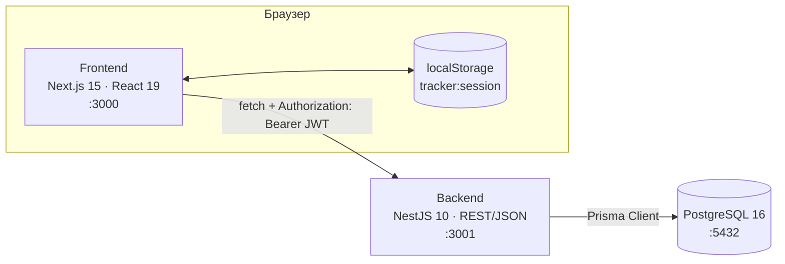
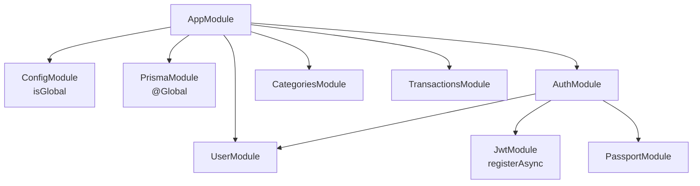
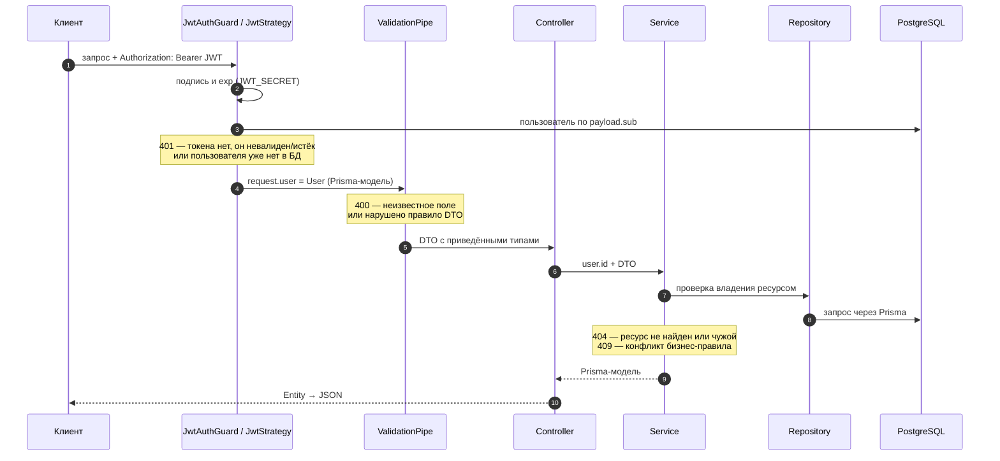
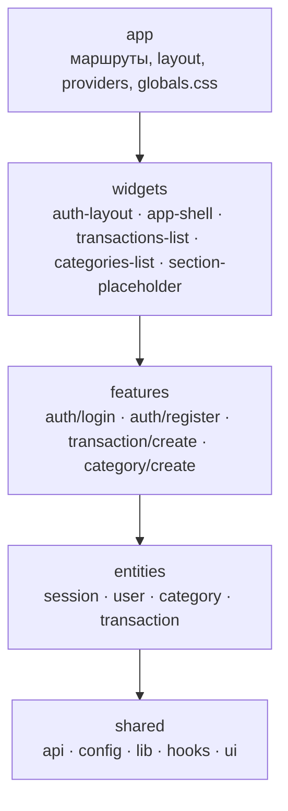
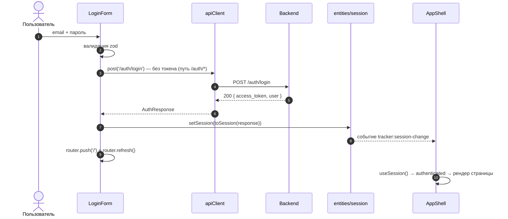
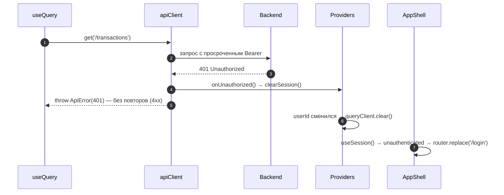

# Архитектура проекта

> **Документация:** Архитектура · [API](api.md) · [База данных](database.md) · [Гайд разработчика](developer-guide.md)
>
> Документ описывает фактическое состояние кода. Если он расходится с кодом — прав код, а документ нужно поправить.

«Трекер расходов» — веб-приложение для учёта личных финансов: пользователь регистрируется, заводит категории, записывает доходы и расходы, а backend считает по ним сводку за месяц.

---

## 1. Обзор системы



| Часть | Роль |
|---|---|
| **Frontend** (`apps/frontend`) | Next.js App Router. Данные загружаются **только на клиенте**: страницы — тонкие серверные компоненты, которые рендерят клиентские виджеты, а те ходят в API через TanStack Query. Серверной загрузки данных, Route Handlers (`route.ts`) и Server Actions нет — при сборке все маршруты пререндерятся как статические |
| **Backend** (`apps/backend`) | Stateless REST API на NestJS. Серверных сессий нет: пользователь аутентифицируется JWT-токеном в заголовке каждого запроса. Документация — Swagger на `/api` |
| **База данных** | PostgreSQL. Backend обращается к ней только через Prisma |
| **Контракт API** | Описан на backend (DTO + Entity + Swagger) и **вручную продублирован** на frontend (TypeScript-типы и zod-схемы). Общего пакета типов и кодогенерации нет — при изменении контракта правятся обе стороны |

---

## 2. Монорепозиторий

```
expense-tracker/
├── apps/
│   ├── backend/           # @tracker/backend — NestJS API
│   └── frontend/          # @tracker/frontend — Next.js
├── .claude/               # docs/ (эта документация), plans/ (планы фич), шаблоны промптов Claude Code
├── .github/workflows/     # CI: автоматическое код-ревью Claude
├── docker-compose.yml     # PostgreSQL, dbhub, backend и frontend (контекст сборки — корень)
├── .dockerignore          # исключает node_modules, .next, .next-dev, dist и .env из контекста сборки
├── turbo.json             # пайплайн задач Turborepo
├── tsconfig.json          # базовый TS-конфиг, расширяется приложениями
├── package.json           # npm workspaces + скрипты-обёртки над turbo
├── CLAUDE.md              # правила проекта (+ apps/backend/CLAUDE.md, apps/frontend/CLAUDE.md)
└── REVIEW.md              # правила code review
```

- **npm workspaces** — `apps/*` и `packages/*`. Единый `package-lock.json` лежит в корне, зависимости поднимаются (hoisting) в корневой `node_modules`. Маска `packages/*` объявлена на будущее: общих пакетов пока нет.
- **Turborepo** запускает одноимённые скрипты во всех workspace-ах:

  | Задача | Настройки в `turbo.json` |
  |---|---|
  | `build` | `dependsOn: ["^build"]`; кэширует `.next/**` (кроме `.next/cache/**`) и `dist/**` |
  | `dev` | без кэша, `persistent` — долгоживущий процесс |
  | `lint`, `typecheck` | кэшируются; `dependsOn` на ту же задачу зависимостей |

  `globalDependencies: ["**/.env.*local"]` — кэш сбрасывают только `.env.*local`-файлы. Обычный `.env` игнорируется git-ом и в хэш задач не входит. Корневой `npm run format` вызывает Prettier напрямую, минуя turbo.
- **TypeScript** — базовый `tsconfig.json` (ES2022, `strict`, `noUncheckedIndexedAccess`, `noImplicitOverride`, `isolatedModules`). Backend переопределяет модульную систему на `commonjs` и включает декораторы (`experimentalDecorators`, `emitDecoratorMetadata`). Frontend добавляет JSX и алиас `@/*` → `src/*`.

---

## 3. Технологический стек

| Область | Технологии |
|---|---|
| Backend | NestJS 10, Prisma 5, `@nestjs/config`, Passport + `passport-jwt`, `@nestjs/jwt`, bcrypt, class-validator / class-transformer, `@nestjs/swagger` 7 |
| Frontend | Next.js 15 (App Router), React 19, TanStack Query 5, react-hook-form 7 + zod 4 (`@hookform/resolvers`), shadcn/ui (CLI 4, стиль `base-nova`, примитивы Base UI — `@base-ui/react`), Tailwind CSS 4, lucide-react |
| База данных | PostgreSQL 16 (образ `postgres:16-alpine`) |
| Инструменты | TypeScript 5 (strict), Turborepo 2, ESLint 8, Prettier 3, Node.js ≥ 20, npm 10 |

Точные версии — в `package.json` приложений и в корневом `package-lock.json`.

---

## 4. Backend

Все пути в этом разделе — относительно `apps/backend/src`, если не указано иное.

### 4.1. Модули



| Модуль | Назначение | HTTP | Экспорт |
|---|---|---|---|
| `AppModule` (`app.module.ts`) | Корневой модуль, health-check | `GET /`, `GET /version` | — |
| `PrismaModule` (`prisma/`) | `PrismaService` = `PrismaClient` с `$connect`/`$disconnect` в хуках жизненного цикла. `@Global()` — доступен везде без импорта | — | `PrismaService` |
| `UserModule` (`user/`) | Создание и поиск пользователей | — | `UserService` |
| `AuthModule` (`auth/`) | Регистрация, вход, выпуск JWT, Passport-стратегия `jwt` | `/auth/*` | — |
| `CategoriesModule` (`categories/`) | CRUD категорий | `/categories` | — |
| `TransactionsModule` (`transactions/`) | CRUD транзакций, пагинация, сводка за месяц | `/transactions` | — |

`JwtAuthGuard` (`auth/guards/`) и декоратор `@CurrentUser()` (`auth/decorators/`) не экспортируются из `AuthModule` как провайдеры: контроллеры других модулей импортируют их напрямую. Guard работает, потому что `AuthModule` регистрирует в Passport стратегию с именем `jwt` (`JwtStrategy`), а `AuthGuard('jwt')` находит её по имени.

### 4.2. Слои модуля

```
Controller  →  Service  →  Repository  →  PrismaService  →  PostgreSQL
    ↑              ↑
   DTO          Entity (ответ наружу)
```

| Слой | Ответственность | Пример |
|---|---|---|
| **DTO** (`dto/*.dto.ts`) | Форма входных данных + правила валидации (`class-validator`) + метаданные Swagger | `CreateTransactionDto`, `FindTransactionsQueryDto` |
| **Controller** | Маршрут, `@UseGuards(JwtAuthGuard)`, Swagger-декораторы, получение пользователя через `@CurrentUser()`, превращение результата сервиса в Entity | `transactions.controller.ts` |
| **Service** | Бизнес-правила: проверка владения (`findOwnedOrThrow`), проверка связанных ресурсов (`ensureCategoryOwned`), конфликты (409), денежная арифметика | `transactions.service.ts` |
| **Repository** | Единственный слой, который инжектирует `PrismaService` и строит запросы | `transactions.repository.ts` |
| **Entity** (`entities/*.entity.ts`) | Ответ наружу: явный белый список полей (скрывает `passwordHash`), `Prisma.Decimal` → строка `"1500.50"`, Swagger-схема | `TransactionEntity`, `PaginatedTransactionsEntity` |

Как правило, контроллер сам оборачивает Prisma-модели в Entity (`new TransactionEntity(transaction)`). Исключение — `GET /transactions/summary`: там `TransactionsService.getSummary()` сразу возвращает `TransactionSummaryEntity`.

Модульная изоляция не строгая: `TransactionsRepository` напрямую читает таблицу категорий (`findCategoryByIdAndUser`, `findCategoriesByIds`), не обращаясь к `CategoriesService`.

### 4.3. Жизненный цикл запроса



- **CORS** (`main.ts`) — разрешён один origin из `FRONTEND_URL` (по умолчанию `http://localhost:3000`), `credentials: true`.
- **Глобальный `ValidationPipe`** — `whitelist: true`, `forbidNonWhitelisted: true`, `transform: true`. Поле без декоратора валидации считается неразрешённым, и запрос с ним отклоняется с 400 (`property X should not exist`), а не проходит молча. `transform` приводит query-строки к числам и датам по `@Type(...)` и выставляет значения по умолчанию из DTO (например, `page = 1`, `limit = 10`).
- **Ошибки** — стандартный exception filter Nest превращает исключения (`NotFoundException`, `ConflictException`, `UnauthorizedException`, ошибки валидации) в JSON `{ statusCode, message, error }`. Необработанные исключения (в том числе ошибки Prisma) дают `500 {"statusCode":500,"message":"Internal server error"}`. Своих фильтров и интерсепторов в проекте нет. Подробности — в [API → Формат ошибок](api.md#4-формат-ошибок).

### 4.4. Аутентификация и авторизация

- **Регистрация** (`POST /auth/register`) — пароль хэшируется bcrypt с 10 раундами (`SALT_ROUNDS` в `auth/auth.service.ts`). Пользователь создаётся после проверки уникальности email (иначе 409), ответ сразу содержит токен — это автологин.
- **Вход** (`POST /auth/login`) — поиск по email и `bcrypt.compare`. На неизвестный email и на неверный пароль ответ одинаковый (401 «Неверный email или пароль»), чтобы нельзя было проверить существование аккаунта.
- **JWT** — подпись HS256 секретом `JWT_SECRET`, payload `{ sub: userId, email, iat, exp }`, срок жизни `JWT_EXPIRES_IN` (в `.env.example` — `3600s`). Refresh-токенов и серверного logout нет: токен действует до `exp`. Отозвать его можно только удалением пользователя, потому что `JwtStrategy.validate()` на каждый запрос подгружает пользователя из БД.
- **`@CurrentUser()`** возвращает сырую Prisma-модель `User`, включая `passwordHash`. Наружу её можно отдавать только через `UserEntity`.
- **Guard навешивается на каждый контроллер вручную** — `@UseGuards(JwtAuthGuard)` + `@ApiBearerAuth()`. Глобального `APP_GUARD` нет: новый контроллер без этих декораторов по умолчанию публичный.
- **Модель доступа** — каждая категория и транзакция принадлежит ровно одному пользователю (`userId`). Identity берётся только из токена. Клиент передаёт лишь ID ресурсов (`:id`, `categoryId`), и сервис до любой операции проверяет, что ресурс принадлежит текущему пользователю. На чужой ресурс ответ **404, а не 403** — это сделано намеренно, чтобы не раскрывать факт существования чужих данных. Repository-методы `update(id, …)` и `delete(id)` принимают голый `id`, поэтому вызываются только после такой проверки.

### 4.5. Деньги и даты

- **Суммы** в БД хранятся как `DECIMAL(12,2)`. В запросах `amount` передаётся JSON-числом: больше 0, не больше двух знаков после запятой, максимум `9999999999.99`. В ответах сумма приходит строкой с двумя знаками (`"1500.50"`), чтобы не терять точность на клиенте. Суммирование в сводке идёт через `Prisma.Decimal` (`.plus()`, `.minus()`, `.toFixed(2)`), приведения к `number` нет.
- **Даты** хранятся в `TIMESTAMP(3)` в UTC. Frontend отправляет дату транзакции как полночь UTC (`2026-09-10T00:00:00.000Z`) и форматирует её в UTC, иначе в западных часовых поясах дата съезжает на день. Сводка за месяц считается по UTC-границам: `[1-е число 00:00 UTC; 1-е число следующего месяца 00:00 UTC)`.

### 4.6. Swagger

`SwaggerModule.setup('api', …)` в `main.ts`: UI на `/api`, OpenAPI JSON на `/api-json`. Схема строится из декораторов `@ApiTags`, `@ApiOperation`, `@ApiResponse` и `@ApiProperty` в контроллерах, DTO и Entity. `addBearerAuth()` добавляет кнопку **Authorize**, куда вставляется токен для защищённых методов.

---

## 5. Frontend

Все пути в этом разделе — относительно `apps/frontend/src`.

### 5.1. Feature-Sliced Design

Frontend организован по адаптации [Feature-Sliced Design](https://feature-sliced.design/) под App Router. Отдельного слоя `pages` нет — его роль выполняют тонкие `page.tsx`.



| Слой | Слайсы | Что внутри |
|---|---|---|
| `app/` | — | Маршруты (`page.tsx`, `layout.tsx`), `providers.tsx`, `globals.css` |
| `widgets/` | `auth-layout`, `app-shell`, `transactions-list`, `categories-list`, `section-placeholder` | Композитные блоки UI: обёртка страниц входа, каркас авторизованной части, список транзакций, список категорий, заглушка нереализованного раздела |
| `features/` | `auth/login`, `auth/register`, `transaction/create`, `category/create` | Пользовательские сценарии: формы и мутации |
| `entities/` | `session`, `user`, `category`, `transaction` | Бизнес-сущности: типы, запросы к API и query-хуки, хранение сессии, UI-строка транзакции, значок категории с палитрой и реестром иконок |
| `shared/` | `api`, `config`, `lib`, `hooks`, `ui` | HTTP-клиент, конфиг, утилиты (форматирование, цвета, `cn`), хуки и компоненты shadcn |

Правила:
- **Импорты только сверху вниз**: `app → widgets → features → entities → shared`. Импорты между слайсами одного слоя запрещены — общая логика уходит на слой ниже.
- **Публичный API слайса** — его `index.ts`. Импортировать можно `@/entities/session`, но не `@/entities/session/model/storage`. `shared` устроен как набор сегментов: `api` и `config` импортируются через свой `index.ts` (`@/shared/api`), а `ui`, `lib` и `hooks` — пофайлово (`@/shared/ui/button`, `@/shared/lib/format`).
- Правила **не проверяются линтером**: в ESLint только `next/core-web-vitals`. Следить за ними приходится на ревью.

### 5.2. Маршруты

| URL | Файл | Доступ | Содержимое |
|---|---|---|---|
| `/` | `app/(dashboard)/page.tsx` | авторизованный | `TransactionsList` — последние транзакции с пагинацией и созданием |
| `/transactions` | `app/(dashboard)/transactions/page.tsx` | авторизованный | Заглушка «Раздел в разработке» |
| `/categories` | `app/(dashboard)/categories/page.tsx` | авторизованный | `CategoriesList` — категории пользователя и создание новой |
| `/login` | `app/login/page.tsx` | публичный | `AuthLayout` + `LoginForm` |
| `/register` | `app/register/page.tsx` | публичный | `AuthLayout` + `RegisterForm` |
| `/terms` | `app/terms/page.tsx` | публичный | Пользовательское соглашение (статичный текст) |
| `/privacy` | `app/privacy/page.tsx` | публичный | Политика обработки данных (статичный текст) |

Route group `(dashboard)` не влияет на URL: её `layout.tsx` оборачивает страницы в `AppShell` — проверку сессии, боковое меню, карточку профиля и заголовок страницы (`h1` внутри панели контента, без отдельной полосы-шапки). Пункты меню задаются в `widgets/app-shell/config/navigation.ts`.

### 5.3. Провайдеры и глобальная настройка

`app/layout.tsx` подключает шрифт Onest через `next/font/google` (переменная `--font-onest` на `<html lang="ru">`, класса `dark` нет) и оборачивает приложение в `Providers` (`app/providers.tsx`), который делает следующее:

1. На уровне модуля регистрирует источник токена `setAuthTokenGetter(() => getSession()?.accessToken ?? null)` и реакцию на 401 `setUnauthorizedHandler(() => clearSession())`. Слой `shared/api` не может импортировать `entities/session`, поэтому связь выполняется через эти два хука в слое `app`.
2. Создаёт `QueryClient` один раз (в `useState`) со значениями по умолчанию:
   - `staleTime: 30_000` — данные считаются свежими 30 секунд;
   - `retry` — ошибки `ApiError` со статусом < 500 не повторяются, сетевые ошибки и 5xx повторяются один раз;
   - `refetchOnWindowFocus: false`.
3. Очищает весь кэш запросов (`queryClient.clear()`) при смене пользователя или выходе. Ключи кэша не содержат `userId`, и без очистки новый пользователь увидел бы данные предыдущего.
4. Подключает `TooltipProvider` для подсказок shadcn.

### 5.4. Сессия и аутентификация на клиенте

- **Хранение.** `entities/session` держит в `localStorage` под ключом `tracker:session` JSON вида `{ accessToken, user }`. Ответ backend (`access_token`) приводится к этой форме функцией `toSession()`.
- **Подписка.** `setSession()` и `clearSession()` генерируют событие `tracker:session-change`, потому что нативный `storage` срабатывает только в других вкладках. Хук `useSession()` через `useSyncExternalStore` слушает оба события и возвращает `{ status: 'loading' | 'authenticated' | 'unauthenticated', session }`. На сервере и до гидратации статус — `loading`, а не `unauthenticated`, иначе происходил бы ложный редирект на `/login`.
- **Защита страниц.** `AppShell` при `unauthenticated` делает `router.replace('/login')`. Пока статус не `authenticated`, он показывает спиннер и **не рендерит дочерние компоненты**, поэтому ни один запрос к API не уходит без токена.
- **Вход и регистрация.** Форма вызывает `POST /auth/login` (или `/auth/register`), затем `setSession(toSession(response))`, `router.push('/')` и `router.refresh()`.
- **Истечение токена.** На клиенте срок действия токена не отслеживается. Первый же запрос с истёкшим токеном получает 401, после чего `clearSession()` сбрасывает сессию, `AppShell` уводит на `/login`, а провайдер очищает кэш.
- **Чего пока нет.** В UI нет кнопки выхода: сессия сбрасывается только по 401. Страницы `/login` и `/register` не перенаправляют уже вошедшего пользователя.

### 5.5. HTTP-клиент (`shared/api`)

| Возможность | Реализация (`shared/api/client.ts`) |
|---|---|
| Методы | `apiClient.get<T>(path)` и `apiClient.post<T>(path, body)`. `patch` и `delete` пока нет — их нужно добавить сюда же, когда понадобятся |
| Базовый URL | `API_URL` из `shared/config` = `NEXT_PUBLIC_API_URL` (по умолчанию `http://localhost:3001`) |
| Токен | `Authorization: Bearer …` подставляется автоматически, **кроме путей `/auth/*`**. Иначе неверный пароль у уже вошедшего пользователя дал бы 401 с токеном и сбросил бы его рабочую сессию |
| Таймаут | 15 секунд (`AbortSignal.timeout`), если вызывающий код не передал свой `signal` |
| Ошибки HTTP | Ответ не 2xx → `ApiError(statusCode, messages[])`, где `message` из формата Nest (строка или массив) нормализован в массив |
| 401 | Если запрос шёл с токеном, вызывается зарегистрированный `onUnauthorized()` |
| Сетевые ошибки | Сбой сети и таймаут выбрасываются как нативные ошибки (`TypeError`, `DOMException`), а не `ApiError` |
| Текст для пользователя | `getApiErrorMessage(error)` — сообщения из `ApiError` или «Не удалось подключиться к серверу…» |

### 5.6. Загрузка данных — TanStack Query

- **Запросы (чтение)** лежат в `entities/<сущность>/api`: функция запроса, фабрика ключей и query-хук.
  - `transactionKeys`: `all` → `lists()` → `list({ page, limit })`; хук `useTransactions(page, limit = TRANSACTIONS_PAGE_SIZE)` с `placeholderData: keepPreviousData`, чтобы при смене страницы не мигал скелетон.
  - `categoryKeys`: `all` → `list()`; хук `useCategories()`.
- **Мутации (сценарии)** лежат в `features/<домен>/<сценарий>/api`. После успеха они инвалидируют кэш по **корневому** ключу сущности: `useCreateTransaction` вызывает `invalidateQueries({ queryKey: transactionKeys.all })`, потому что новая транзакция может сдвинуть любую страницу списка. `useCreateCategory` инвалидирует `categoryKeys.all` — так обновляются и список на `/categories`, и `Select` в форме транзакции.
- Размер страницы `TRANSACTIONS_PAGE_SIZE = 10` (`entities/transaction/config/pagination.ts`) совпадает с `limit` по умолчанию на backend.

### 5.7. Формы

- react-hook-form + zod через `zodResolver`. Готового shadcn-компонента `Form` нет: поля собираются из примитивов `Field`, `FieldGroup`, `FieldLabel`, `FieldError` (`shared/ui/field.tsx`).
- Схема лежит в `model/schema.ts` фичи. Значения формы хранятся в том виде, в каком их вводит пользователь (например, `amount` — строка, допускается запятая), а в payload API их переводит функция `to…Payload()`.
- Серверная ошибка показывается как `rootError` через `getApiErrorMessage()`.
- Правила zod-схем вручную повторяют правила DTO на backend. Например, пароль не короче 6 символов, сумма не больше `9 999 999 999.99`, описание не длиннее 255 символов, название категории — от 1 до 50 символов после обрезки пробелов. При изменении DTO схему нужно обновить.

### 5.8. UI и стили

- **shadcn/ui** — стиль `base-nova`, примитивы Base UI вместо Radix. Композиция идёт через проп `render`, а не `asChild`: например, `<SidebarMenuButton render={<Link … />} />`. Компоненты ставятся в `shared/ui`, их хуки — в `shared/hooks` (алиасы в `components.json`).
- **Tailwind CSS 4** подключён через `@tailwindcss/postcss`; конфигурация темы — в `app/globals.css`, отдельного `tailwind.config` нет.
- **Тема только светлая.** Палитра проекта задана в `:root`: `--canvas`, `--paper`, `--ink`, пастель `--mint` / `--periwinkle` / `--peach`, `--field`, `--line`, `--ink-muted`, `--success`, `--danger`. Токены shadcn (`--background`, `--primary`, `--muted` и т.д.) заданы там же и сопоставлены с палитрой, а в `@theme inline` превращены в Tailwind-цвета: `bg-background`, `bg-canvas`, `bg-mint`, `text-muted-foreground`, `text-income` и т.п. Шрифт — Onest (кириллица). Радиусы по иерархии: 24px — карточки и диалоги, 32px — панель контента, `rounded-full` — кнопки и поля.
- **Форматирование** (`shared/lib/format.ts`): `formatMoney` форматирует рубли в локали `ru-RU`, `formatDate` — дату в UTC, `dateInputToIso` превращает `YYYY-MM-DD` в ISO-строку на полночь UTC.
- **Строка транзакции** — круглая пастельная иконка направления (мятная со стрелкой `ArrowDownLeft` для дохода, персиковая со стрелкой `ArrowUpRight` для расхода); цвет категории показывается точкой перед названием, а не заливкой (пользовательский HEX на светлом фоне не годится для фона). Иконка категории здесь не выводится.
- **Значок категории** (`CategoryIcon`, `entities/category`) — иконка цвета категории на подложке из того же цвета, разбавленного до 16% (`color-mix`); выводится на `/categories`. Backend хранит в `icon` имя lucide-иконки (`shopping-cart`), компонент берётся из статического реестра `CATEGORY_ICONS` (`entities/category/config/icons.ts`), имя не из реестра рисуется иконкой `tag`. Цвет новой категории выбирается только из палитры `CATEGORY_COLORS` (8 цветов): контраст каждого ≥ 3:1 и для кружка на светлом фоне, и для иконки на подложке.

---

## 6. Ключевые сценарии

### 6.1. Вход в приложение



### 6.2. Главная страница

1. `app/(dashboard)/layout.tsx` рендерит `AppShell`. Он ждёт, пока `useSession()` вернёт `authenticated`: без сессии уводит на `/login`, а пока идёт проверка — показывает спиннер.
2. `app/(dashboard)/page.tsx` рендерит виджет `TransactionsList`. Тот параллельно запускает `useTransactions(page)` (`GET /transactions?page=…&limit=10`) и `useCategories()` (`GET /categories`), а категории сопоставляет с транзакциями по `categoryId`.
3. Пока хотя бы один из двух запросов в ожидании, показывается скелетон. Ошибка загрузки транзакций выводится с кнопкой «Повторить». Ошибка загрузки категорий выводится отдельным баннером, а список при этом остаётся доступен.
4. Пагинация: номер страницы — локальный state виджета. Последнее известное `totalPages` сохраняется, чтобы навигация не пропадала при ошибке загрузки следующей страницы. Если текущая страница перестала существовать, выполняется переход на последнюю существующую.

### 6.3. Создание транзакции

1. `CreateTransactionDialog` → `CreateTransactionForm`. Список категорий для `Select` берётся из `useCategories()`. Пока категории не загружены, `Select` и кнопка «Добавить» заблокированы.
2. zod-валидация, затем `toCreateTransactionPayload()`: сумма превращается в число, дата — в полночь UTC, пустое описание — в `undefined`.
3. `useCreateTransaction().mutate(payload)` → `POST /transactions`. Повторную отправку до завершения запроса блокирует синхронный `ref`-флаг.
4. После успеха инвалидируется `transactionKeys.all`, диалог закрывается, список переходит на первую страницу.

Если категорий у пользователя ещё нет, `Select` заблокирован, а подсказка под ним ведёт ссылкой на `/categories`.

### 6.4. Создание категории

1. `/categories` рендерит виджет `CategoriesList` (`useCategories()`), в его шапке — `CreateCategoryDialog` → `CreateCategoryForm`.
2. Значения по умолчанию: иконка `tag`, цвет — первый цвет палитры, которого ещё нет у категорий пользователя (`pickFreeCategoryColor`). Цвет и иконка выбираются нативными radio-группами; выбранная иконка рисуется в выбранном цвете.
3. zod-валидация (название обрезается, от 1 до 50 символов), затем `toCreateCategoryPayload()` → `useCreateCategory().mutate(payload)` → `POST /categories`. Повторную отправку до завершения запроса блокирует синхронный `ref`-флаг.
4. После успеха инвалидируется `categoryKeys.all`, диалог закрывается. Backend сортирует категории по `createdAt`, поэтому новая появляется в конце списка; она же сразу доступна в `Select` формы транзакции.

### 6.5. Истёкший токен



---

## 7. Инфраструктура

### 7.1. Окружения и запуск

- **Локальная разработка.** PostgreSQL запускается в Docker (`docker-compose up postgres -d`: контейнер `tracker-db`, том `tracker_postgres_data`, healthcheck `pg_isready`). Приложения запускаются на хосте командой `npm run dev` через Turborepo. Порты: frontend 3000, backend 3001, PostgreSQL 5432.
- **Полный стек в Docker**: `docker compose up --watch`. Контекст сборки backend и frontend — корень монорепозитория, потому что lockfile npm workspaces лежит только там. `Dockerfile` ставит зависимости слоем `npm ci -w apps/<имя>`, работает от пользователя `node`, запускает `npm run dev`. Правки в `src` (и `public` у frontend) синхронизирует Compose Watch (`develop.watch`), изменения `package.json`, `package-lock.json`, `prisma/` и `next.config.ts` пересобирают образ. Секреты backend читаются из необязательного `apps/backend/.env` (`env_file`). Backend-образу нужен пакет `openssl`: Prisma 5 на Alpine 3.21+ без него не находит libssl.
- Имя compose-проекта зафиксировано как `name: tracker`. Иначе Compose взял бы его из имени папки, и после переименования папки создал бы новый пустой том БД.

### 7.2. Переменные окружения

| Приложение | Переменная | Назначение |
|---|---|---|
| backend | `DATABASE_URL` | Строка подключения PostgreSQL для Prisma |
| backend | `PORT` | Порт HTTP-сервера (по умолчанию 3001) |
| backend | `NODE_ENV` | Используется только в ответе `GET /version` |
| backend | `FRONTEND_URL` | Разрешённый CORS origin (по умолчанию `http://localhost:3000`) |
| backend | `JWT_SECRET` | Секрет подписи JWT. **Обязателен** — без него backend не стартует |
| backend | `JWT_EXPIRES_IN` | Срок жизни токена — строка с единицей измерения (`3600s`, `1h`); без единицы значение считается в миллисекундах. **Обязателен** — без него падают вход и регистрация |
| frontend | `NEXT_PUBLIC_API_URL` | Базовый URL API; встраивается в клиентский бандл при сборке или старте dev-сервера |

Шаблоны лежат в `apps/*/.env.example`. Полная таблица со значениями по умолчанию — в [гайде разработчика](developer-guide.md#4-переменные-окружения).

### 7.3. CI

| Workflow | Триггер | Что делает |
|---|---|---|
| `.github/workflows/claude-code-review.yml` | открытие, обновление, reopen и `ready_for_review` PR | Плагин `code-review` для Claude Code (`anthropics/claude-code-action`) публикует замечания в PR. Правила ревью проекта описаны в `REVIEW.md` |
| `.github/workflows/claude.yml` | упоминание `@claude` в issue, PR или комментарии | Claude выполняет запрос из комментария |

`typecheck`, `lint`, `build` и тесты в CI **не запускаются**: их прогоняют локально перед коммитом, как требует `CLAUDE.md`. Unit-тесты (Jest) пока есть только в backend (`npm run test -w @tracker/backend`).

---

## 8. Архитектурные решения и ограничения

| Решение | Что даёт | Следствия |
|---|---|---|
| JWT в `localStorage`, без refresh-токена | Простая модель для SPA: нет cookie и связанной с ними защиты от CSRF | XSS равнозначен краже токена — опасные DOM-sinks проверяются на ревью (см. `REVIEW.md`). После истечения `JWT_EXPIRES_IN` нужно войти заново |
| 404 вместо 403 для чужих ресурсов | Не раскрывает существование чужих данных (так описано в `apps/backend/CLAUDE.md`) | Клиент не отличает «не существует» от «чужое» — так и задумано |
| Guard на каждом контроллере, без глобального | Защита видна прямо в контроллере | Новый контроллер без `@UseGuards(JwtAuthGuard)` будет публичным |
| Контракт API дублируется вручную | Нет общего пакета и шага кодогенерации в сборке | Изменение DTO или Entity требует синхронной правки типов и zod-схем на frontend |
| Offset-пагинация с `count` в одной транзакции (`$transaction([findMany, count])`) | Простота; `total` согласован с `items` | Стоимость запроса растёт с номером страницы (`page` ограничен сверху значением 1 000 000) |
| Деньги — `DECIMAL(12,2)`, в API строки | Без ошибок плавающей точки | На клиенте не суммировать `number` — итоги берутся с backend (`/transactions/summary`) |
| Даты транзакций — полночь UTC, сводка по UTC | Одинаковый результат в любом часовом поясе | Frontend обязан форматировать даты транзакций с `timeZone: 'UTC'` |
| Категорию с транзакциями удалить нельзя | Нет «висячих» транзакций | 409 от сервиса + внешний ключ `ON DELETE NO ACTION` как страховка на уровне БД |
| Данные грузятся только на клиенте | Сервер Next.js не участвует в аутентификации: токен живёт только в браузере (`localStorage`) | SSR с данными невозможен без переноса токена в cookie |
| Одна светлая тема | Упрощение дизайн-системы | Цветовые токены shadcn заданы в `:root`, `dark:`-варианты в компонентах не работают |

Список известных проблем и недоделок — в [гайде разработчика](developer-guide.md#11-известные-проблемы-и-ограничения).
